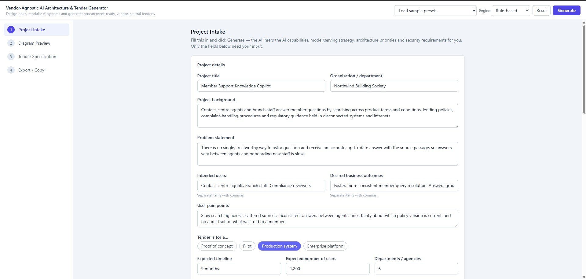
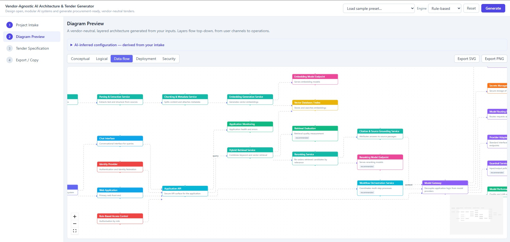
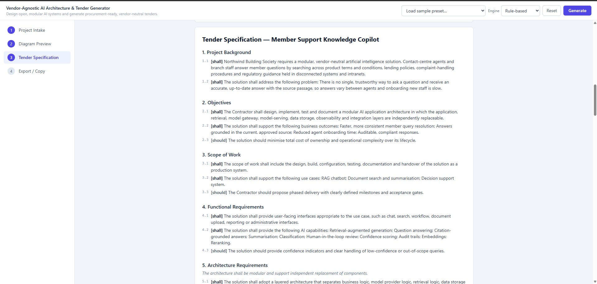
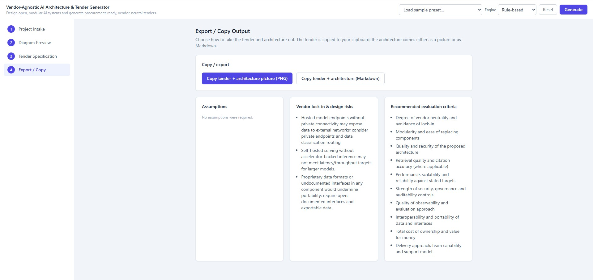

# AI Tender Architect

**Vendor-agnostic AI architecture & tender specification generator.**

A form-driven web app that turns structured project inputs into two procurement-ready outputs:

1. A **layered, vendor-neutral architecture diagram** (Conceptual + Logical views).
2. A **vendor-neutral tender specification** with formal `shall` / `should` clauses, vendor
   lock-in prevention clauses, acceptance tests, deliverables and evaluation criteria.

It helps design AI / RAG / LLM / agentic systems that are **open, modular, swappable and vendor
agnostic** — describing *what capabilities are required* rather than *which product must be used*.

> Repo: <https://github.com/beese54/ai-tender-architect>

## Screenshots

| Project intake | Architecture diagram |
| --- | --- |
|  |  |

| Tender specification | Export / copy |
| --- | --- |
|  |  |

## Quick start

```bash
npm install
npm run dev      # http://localhost:5173
```

Other scripts:

```bash
npm run test     # vitest unit tests (generation logic)
npm run build    # tsc -b typecheck + production build
npm run lint     # eslint
```

The app opens pre-loaded with a **fictitious sample scenario** (a member-support knowledge
copilot for the fictional "Northwind Building Society") so you can click **Generate** straight
away. Use **Reset** to clear it, or pick another scenario from **Load sample preset**.

## How to use

1. **Load a preset** (top bar) or fill the form across the first three steps:
   - **Project Intake** — project details, use cases, data & knowledge sources.
   - **Architecture Configuration** — AI capabilities, model/serving strategy, priorities, performance.
   - **Vendor-Agnostic Requirements** — security/governance, tender tone & length, what to include,
     and the **Include non-mandatory reference examples** toggle.
2. Click **Generate**. The preview steps unlock:
   - **Diagram Preview** — switch Conceptual/Logical, export **SVG/PNG**.
   - **Tender Specification** — numbered clauses + a live **vendor-neutrality** check.
   - **Export / Copy** — copy or download Markdown (tender / architecture / combined), **PDF**,
     plus assumptions, lock-in risks and recommended evaluation criteria.

## Vendor neutrality

The tender names **no** specific vendors, clouds, GPUs, vector databases, inference engines or
observability tools by default. If a flagged term (e.g. NVIDIA, vLLM, AWS, Qdrant, Kubernetes, …)
appears in a mandatory/desirable clause, the **vendor-neutrality checker** warns you. Specific
technologies appear only inside a clearly-labelled non-mandatory examples section, and only when you
enable reference examples.

## Architecture

- **Vite + React 18 + TypeScript + Tailwind**, **React Flow** (diagram), **Zustand** (state).
- The 12 architecture layers and their vendor-neutral nodes live in `src/constants/layers.ts`
  (single source of truth for generation, diagram and tender coverage).
- Generation runs behind a provider-agnostic interface (`src/generation/types.ts`,
  `GenerationProvider`). The default is fully deterministic and rule-based
  (`src/generation/ruleBased/`); an LLM-backed provider can be added later without UI changes.
- Key modules: `architectureGenerator`, `tenderSpecGenerator`, `diagramGenerator`,
  `vendorNeutralityChecker`, `exportUtils`, and presets in `src/constants/presets.ts`.

## Optional: LLM-backed generation

The rule-based engine needs no configuration. To experiment with an Azure OpenAI-backed engine,
copy `.env.example` to `.env.local` and set the `VITE_AZURE_OPENAI_*` values. `.env.local` is
gitignored and must never be committed.

## Licence

No licence has been specified yet. Add one before publishing if you intend others to reuse the code.
